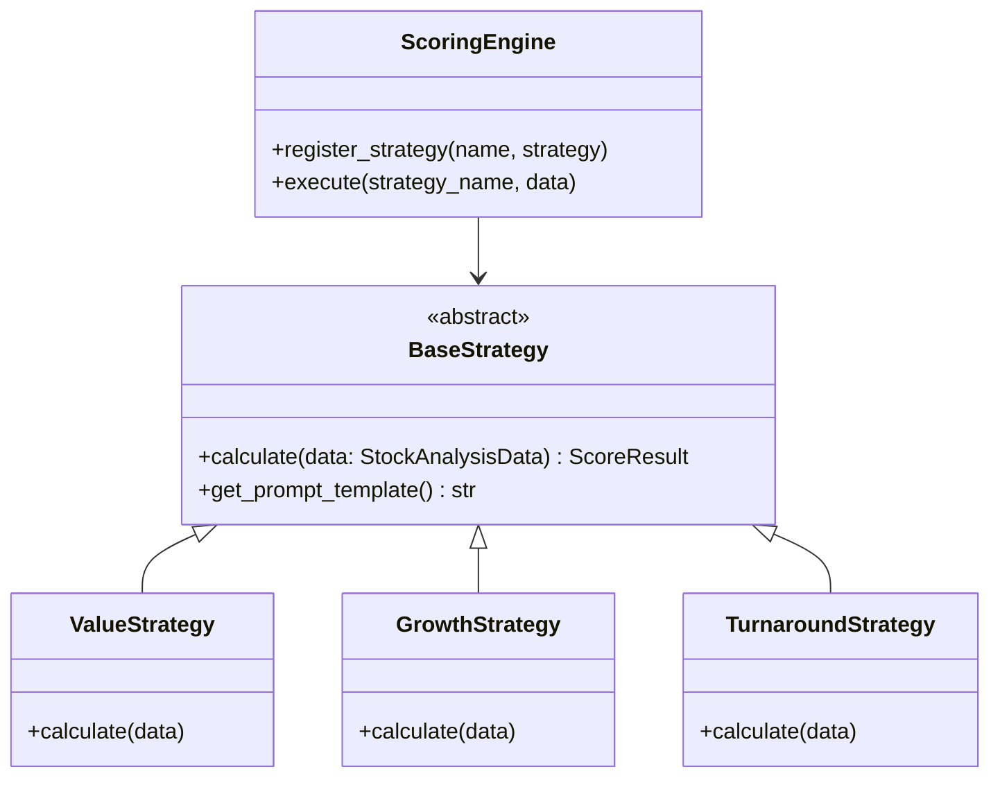

# システム全体最適化とクリーンアーキテクチャへのリファクタリング提案

## 1. 現状の課題
- **型安全性の欠如**: データが `dict` や `pd.Series` のまま流れており、フィールド名のミススペルや型不一致が実行時まで判明しない。
- **ロジックの肥大化**: `calc/v2.py` に全てのスコアリングロジック（Value, Growth, Turnaround）が集中しており、保守性が低い。
- **ハードコーディング**: 指標名やバリデーションルールがコード内に散在している。
- **処理速度**: 抽出・検証フェーズが直列実行されており、銘柄数増加に伴いボトルネックになる可能性がある。

## 2. 新アーキテクチャ提案

### A. データモデルの導入 (Pydantic / Dataclasses)
`src/domain/` ディレクトリを新設し、システム全体で利用する共通データモデルを定義します。

```python
# src/domain/models.py
from pydantic import BaseModel, Field
from typing import Optional, Dict

class StockAnalysisData(BaseModel):
    code: str
    name: str
    sector: str
    current_price: float
    per: Optional[float] = None
    pbr: Optional[float] = None
    # ... 他の全指標

class AnalysisTask(BaseModel):
    stock_data: StockAnalysisData
    strategy_name: str
    prompt: str
    quant_score: float
    confidence_score: float = 1.0
    is_valid: bool = True
    error_reason: Optional[str] = None
```

### B. Strategyパターンの適用
`src/calc/strategies/` に戦略ごとのロジックを分離します。



### C. Config駆動型マッピング
`config.yaml` にメタデータマッピングを集約し、コード内のハードコードを排除します。

```yaml
# config.yaml
metadata_mapping:
  metrics:
    operating_cf_margin: "operating_cf"
    net_sales: "sales"
  validation:
    critical_threshold: 7  # 7/11 items missing
```

### D. 並列処理による高速化
`ValidationEngine` とプロンプト生成はCPUバウンドな処理が多いため、`ProcessPoolExecutor` (または `ThreadPoolExecutor`) を導入します。

## 3. ディレクトリ構成案

```
stock-analyzer3/
├── config/
│   └── config.yaml  <-- Mapping追加
├── src/
│   ├── domain/      <-- [NEW]
│   │   ├── __init__.py
│   │   └── models.py (Pydantic models)
│   ├── calc/
│   │   ├── strategies/ <-- [NEW]
│   │   │   ├── base.py
│   │   │   ├── value.py
│   │   │   ├── growth.py
│   │   │   ├── turnaround.py
│   │   │   └── __init__.py
│   │   └── engine.py (ScoringEngine orchestrator)
│   ├── validation_engine.py (Update to use models & config)
│   ├── equity_auditor.py (Update to use parallel exec)
│   └── ...
└── ...
```

## 4. 移行ステップ
1. **Model Definition**: Pydantic モデルの作成。
2. **Migration**: `equity_auditor` と `ValidationEngine` をモデルベースに変更。
3. **Refactor Scoring**: `calc/v2.py` を解体し、Strategy クラスへ移行。
4. **Optimization**: 並列処理の実装。

本提案に基づき、リファクタリングを進めてよろしいでしょうか？ To PROCEED, please approve.
