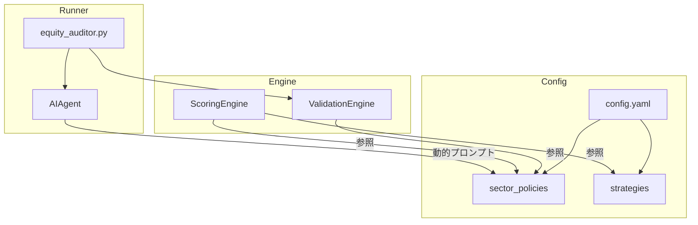

# セクター別バリデーション/スコアリング アーキテクチャ再設計案

## 1. 概要
銀行業（`debt_equity_ratio`欠損100%）や情報・通信業（`free_cf`欠損70%）など、セクター特有の「構造的欠損」に対応するため、バリデーションおよびスコアリングロジックを柔軟化する。

---

## 2. モジュール構成図



---

## 3. 主要コンポーネント

### 3.1 ValidationEngine (新規)
**ファイル**: `src/validation_engine.py`
**役割**: タスクデータのバリデーションを担当。セクター別ポリシーを参照し、構造的欠損を許容。

**メソッド**:
- `validate(task: dict, sector: str, strategy: str) -> tuple[bool, str]`
- ポリシー参照: `config['sector_policies'][sector]['na_allowed']`

### 3.2 ScoringEngine (既存改修)
**ファイル**: `src/calc/v2.py` (V2ScoringMixin)
**改修内容**:
- `calc_v2_score` に「正規化（Normalization）」ロジックを追加。
- 欠損項目の配点を他の有効項目に再配分し、100点満点を維持。

### 3.3 AIAgent (既存改修)
**ファイル**: `src/ai_agent.py`
**改修内容**:
- `_create_prompt` にセクター別のメタ指示を動的に挿入。
- 例: 「この銘柄は銀行業のため、Debt/Equity Ratioは分析対象外とする」

---

## 4. config.yaml 新スキーマ案

```yaml
sector_policies:
  銀行業:
    na_allowed:  # これらの欠損は許容（構造的欠損）
      - debt_equity_ratio
      - operating_margin
    score_exemptions: # スコアリングから除外
      - debt_equity_ratio
    ai_prompt_excludes: # AIプロンプトで「分析対象外」と明示
      - Debt/Equity Ratio
  情報・通信業:
    na_allowed:
      - free_cf
      - operating_cf
    score_exemptions:
      - free_cf
    ai_prompt_excludes:
      - Free CF
  # 他セクターは空（全項目必須）
  default:
    na_allowed: []
    score_exemptions: []
    ai_prompt_excludes: []
```

---

## 5. スコア再配分（正規化）ロジック

### 5.1 概念
**目標**: 欠損項目があっても、残りの有効項目で100点満点を維持する。

**例**: `value_strict` 戦略で `debt_equity_ratio` (配点10点) が銀行業で欠損の場合、
- 元の配点合計: 100点 (仮)
- 有効項目の配点合計: 90点
- 正規化係数: `100 / 90 = 1.111`
- 各項目の得点に係数を乗算

### 5.2 擬似コード
```python
def calc_normalized_score(row: dict, sector: str, strategy_cfg: dict) -> dict:
    """セクター別正規化スコア計算"""
    points = strategy_cfg['points']
    exemptions = get_sector_policy(sector).get('score_exemptions', [])
    
    # 1. 有効項目のみ抽出
    valid_points = {k: v for k, v in points.items() if k not in exemptions}
    
    # 2. 配点合計
    total_alloc = sum(points.values())
    valid_alloc = sum(valid_points.values())
    
    # 3. 正規化係数
    if valid_alloc > 0:
        norm_factor = total_alloc / valid_alloc
    else:
        norm_factor = 1.0
    
    # 4. スコア計算（各項目得点 × 正規化係数）
    raw_score = 0.0
    for metric, pts in valid_points.items():
        if evaluate_metric(row, metric):
            raw_score += pts * norm_factor
    
    return {'quant_score': round(raw_score, 1), ...}
```

---

## 6. 改修対象ファイル一覧

| ファイル                   | 変更種別 | 概要                                              |
| -------------------------- | -------- | ------------------------------------------------- |
| `config/config.yaml`       | MODIFY   | `sector_policies` セクション追加                  |
| `src/validation_engine.py` | NEW      | ValidationEngine クラス新規作成                   |
| `src/calc/v2.py`           | MODIFY   | 正規化ロジック追加                                |
| `src/ai_agent.py`          | MODIFY   | `_create_prompt` にセクター除外メタ指示追加       |
| `equity_auditor.py`    | MODIFY   | `validate_task_data` を `ValidationEngine` に置換 |

---

## 7. 検証計画

1. **Unit Tests**: `ValidationEngine` と正規化ロジックの単体テスト作成。
2. **Integration Test**: 銀行業銘柄を含むExtract/Ingestフローを再実行し、隔離されないことを確認。
3. **Comparison Test**: 既存ロジックと新ロジックで、非銀行業銘柄のスコアが変化しないことを確認。

---

## 8. 技術的考慮事項（ユーザーフィードバック）

### 8.1 セクター名の「名寄せ」とフォールバック
`config.yaml` の `sector_policies` で定義するセクター名は、DB内の `sector` カラムと完全一致する必要がある。

**対策**:
- `ValidationEngine` に `get_policy(sector: str)` メソッドを実装。
- 定義されていないセクターは自動的に `default` ポリシーを適用。
- 初回起動時にDBの全セクター名と `config.yaml` の定義を照合し、未定義セクターを警告ログ出力。

### 8.2 正規化の「安全性しきい値」
`score_exemptions` が多すぎる場合、残った少数の指標に重みが集中しスコアが極端になるリスク。

**対策**:
- `valid_alloc / total_alloc` が設定可能なしきい値（デフォルト50%）を下回る場合:
    1. 警告ログ出力 (`⚠️ Low coverage: {sector} has only {pct}% of scoring metrics available`)
    2. 結果に `low_confidence: true` フラグを付与
    3. 将来的にはAIプロンプトにも「信頼性が低い」旨を伝達

```yaml
# config.yaml 追加設定
scoring:
  min_coverage_pct: 50  # 有効配点がこの割合以下なら警告
```

### 8.3 `collector.py` / `data_fetcher.py` との将来連携
データ収集フェーズでも `sector_policies` を参照することで効率化が可能。

**将来ロードマップ**:
- `collector.py` が特定セクターのデータ取得時に `na_allowed` を参照
- 「取得不要なフィールド」をスキップし、API呼び出し回数を削減
- `fetch_status` に「構造的N/A」と「取得エラー」を区別して記録

> [!NOTE]
> この機能は Phase 2 以降の実装対象とし、本フェーズでは抽出/スコアリングに注力する。
