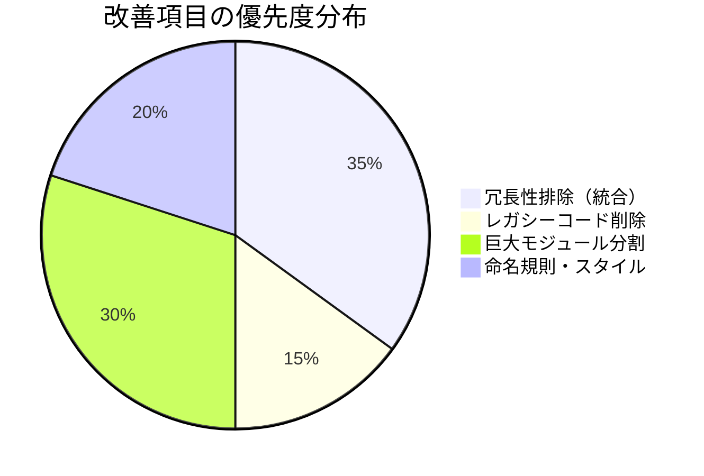

# リファクタリング最適化プロポーザル

> **起案日**: 2026-01-01  
> **目的**: 機能追加・修正の積み重ねによる技術的負債を解消し、全体最適化を実施

---

## 1. エグゼクティブサマリー

本プロポーザルは、**冗長性排除**、**処理効率向上**、**保守性**、**可読性確保**の4観点からリファクタリング項目を提案します。



---

## 2. 調査結果

### 2.1 コードベース統計

| カテゴリ                      | ファイル数 | 概算行数 |
| ----------------------------- | ---------- | -------- |
| `src/` 主要モジュール         | 22         | ~7,500行 |
| `src/calc/` (スコアリング)    | 10         | ~2,000行 |
| `src/commands/` (CLIコマンド) | 5          | ~1,800行 |
| `src/fetcher/` (データ取得)   | 5          | ~1,000行 |
| `tests/` (テスト)             | 42         | ~5,000行 |

### 2.2 特定した問題

#### 🔴 高優先度: 機能重複

| 重複パターン             | 関連ファイル                                                                       | 問題                                                                       |
| ------------------------ | ---------------------------------------------------------------------------------- | -------------------------------------------------------------------------- |
| **バリデーション**       | `validator.py` (125行) / `validation_engine.py` (252行)                            | 類似のバリデーションロジックが2つ存在。`_is_empty()`等のユーティリティ重複 |
| **レポート生成**         | `reporter.py` (213行) / `result_writer.py` (107行) / `report_generator.py` (441行) | CSV出力が3クラスに分散                                                     |
| **スコアリングエンジン** | `src/engine.py` (79行) / `src/calc/engine.py` (134行)                              | `AnalysisEngine` と `ScoringEngine` の責務曖昧                             |

#### 🟡 中優先度: アーカイブ対象

| ファイル                         | 理由                      |
| -------------------------------- | ------------------------- |
| `src/archive/excel_formatter.py` | CSV出力に移行済み、未使用 |
| `src/archive/lock_excel.py`      | 上記と同様                |
| `tests/archive/` (4ファイル)     | テスト対象が削除済み      |

#### 🟠 中優先度: 巨大モジュール

| ファイル          | 行数  | 責務数 | 推奨                                      |
| ----------------- | ----- | ------ | ----------------------------------------- |
| `ai_agent.py`     | 840行 | 5+     | プロンプト生成、API通信、パース処理の分離 |
| `orchestrator.py` | 614行 | 4+     | Daily/Weekly/Monthlyルーチンの分離検討    |

#### 🟢 低優先度: スタイル統一

- 日本語/英語コメントの混在
- Docstring形式の不統一（一部Google Style、一部なし）
- ネストしたヘルパー関数（`_s()`, `_safe_float()`等）の外部化

---

## 3. 提案する変更

### Phase 1: 冗長性の排除（高優先度）

#### 1.1 バリデーション統合

**[MODIFY]** [validation_engine.py](file:///home/irom/stock-analyzer3/src/validation_engine.py)
- `DataValidator` の機能を `ValidationEngine` に吸収
- `_is_empty()` を `src/utils.py` へ移動（共通ユーティリティ化）

**[DELETE]** [validator.py](file:///home/irom/stock-analyzer3/src/validator.py)
- 全ての参照を `ValidationEngine` に切り替え後、削除

---

#### 1.2 レポート生成統合

**[MODIFY]** [reporter.py](file:///home/irom/stock-analyzer3/src/reporter.py)
- `StockReporter` を主要なレポート生成クラスとして維持
- `ResultWriter.save()` のカラムリネーム・整形ロジックを統合

**[MODIFY]** [result_writer.py](file:///home/irom/stock-analyzer3/src/result_writer.py)
- シンプルな「ファイル書き込みユーティリティ」に縮小
- または `StockReporter` に完全統合後、削除

**[KEEP]** [report_generator.py](file:///home/irom/stock-analyzer3/src/report_generator.py)
- HTML レポート生成専用として維持（責務が異なる）

---

#### 1.3 エンジン統合

**[DELETE]** [src/engine.py](file:///home/irom/stock-analyzer3/src/engine.py)
- `AnalysisEngine` の責務を `ScoringEngine` に統合
- `filter_and_rank()` は `src/calc/engine.py` に移動

---

### Phase 2: レガシーコード削除（中優先度）

**[DELETE]** 以下のファイルを削除:
- `src/archive/excel_formatter.py`
- `src/archive/lock_excel.py`
- `tests/archive/` ディレクトリ (4ファイル)

---

### Phase 3: 巨大モジュール分割（中優先度）

#### 3.1 AIAgent分割

現状の `ai_agent.py` (840行) を以下に分割:

```text
src/ai/
├── __init__.py
├── agent.py          # メインクラス (APIコール、分析のオーケストレーション)
├── prompt_builder.py # _prepare_variables, _create_prompt, _load_prompt_template
├── response_parser.py# _parse_response, _validate_response
└── key_manager.py    # APIキーローテーション管理
```

> [!WARNING]
> この分割は大規模な変更となるため、Phase 1-2完了後に実施を推奨

---

### Phase 4: スタイル統一（低優先度）

- コメント言語: 日本語に統一（`GEMINI.md` ルールに従う）
- Docstring: Google Style で統一
- ヘルパー関数: モジュールトップレベルまたは`utils.py`に移動

---

## 4. 影響範囲と検証計画

### 4.1 影響範囲

| 変更               | 影響を受けるモジュール                   |
| ------------------ | ---------------------------------------- |
| バリデーション統合 | `ai_agent.py`, `commands/analyze.py`     |
| レポート統合       | `orchestrator.py`, `commands/extract.py` |
| エンジン統合       | `sentinel.py`, `equity_auditor.py`       |

### 4.2 検証計画

#### 自動テスト

```bash
# 1. 既存テストスイートの完全実行
python self_diagnostic.py

# 2. カバレッジテスト (目標: 80%維持)
python -m pytest tests/ --cov=src --cov-report=term-missing

# 3. インテグレーションテスト
python -m pytest tests/test_integration_*.py -v
```

#### 手動検証

リファクタリング前後で同一入力に対して**同一出力を確認**:

1. **スクリーニング実行**
   ```bash
   python equity_auditor.py --mode analyze --strategy value_strict --limit 5
   ```
2. 出力CSVの差分比較（`diff` または Excelで確認）

---

## 5. 実施スケジュール案

| Phase   | 内容           | 工数見積 | 依存      |
| ------- | -------------- | -------- | --------- |
| Phase 1 | 冗長性排除     | 2-3日    | なし      |
| Phase 2 | レガシー削除   | 0.5日    | Phase 1   |
| Phase 3 | モジュール分割 | 3-5日    | Phase 1-2 |
| Phase 4 | スタイル統一   | 1-2日    | 任意      |

---

## 6. ユーザーレビュー事項

> [!IMPORTANT]
> 以下について確認・ご判断をお願いいたします。

1. **Phase 3 (巨大モジュール分割) の優先度**: 
   - 今回のスコープに含めるか、後日対応とするか?

2. **レガシーコードの取り扱い**:
   - `src/archive/` を完全削除して良いか?

3. **Phase 4 (スタイル統一) の範囲**:
   - 全ファイル対象 or 新規変更ファイルのみ?

---

## 変更履歴

| 日付       | バージョン | 内容     |
| ---------- | ---------- | -------- |
| 2026-01-01 | v1.0       | 初版作成 |
