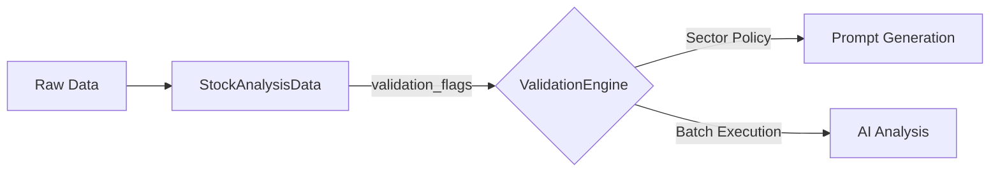

# ValidationEngine 責務整理プロポーサル

## 現状分析

### ValidationEngine の責務 (434行)

| 責務                 | メソッド                            | 行数  | 重複状況 |
| :------------------- | :---------------------------------- | :---- | :------- |
| プロンプト検証       | `validate()`                        | 138行 | **固有** |
| セクターポリシー管理 | `get_policy()`, `get_ai_excludes()` | 10行  | **固有** |
| データ品質検証       | `validate_stock_data()`             | 100行 | **重複** |
| 異常値検知           | `is_abnormal()`                     | 40行  | **重複** |
| バッチ処理           | `validate_batch()`                  | 60行  | **固有** |

### StockAnalysisData (Pydantic) の責務

| 責務                 | 実装                         |
| :------------------- | :--------------------------- |
| Tier1/Tier2 欠損検出 | `model_validator` で自動実行 |
| 異常値検知（足切り） | `model_validator` で自動実行 |
| Red Flag 検知        | `model_validator` で自動実行 |
| 例外救済判定         | `model_validator` で自動実行 |

> [!WARNING]
> **重複**: `validate_stock_data()` と `is_abnormal()` の責務は、`StockAnalysisData` の `model_validator` と完全に重複しています。

---

## 提案: 責務再編成

### 方針: 「データ検証は Pydantic、フロー制御は Engine」



### 提案する責務分担

| 責務             | 移管先       | 理由                                      |
| :--------------- | :----------- | :---------------------------------------- |
| データ型検証     | **Pydantic** | 宣言的定義で保守性向上                    |
| 欠損検出         | **Pydantic** | `ValidationFlag.tier1_missing` で自動判定 |
| 異常値検知       | **Pydantic** | `SkipReason` で型安全に管理               |
| セクターポリシー | **Engine**   | 動的設定の適用はEngineが適任              |
| プロンプト検証   | **Engine**   | 文字列解析ロジックはEngine固有            |
| バッチ処理       | **Engine**   | 並列実行制御はEngine固有                  |

---

## 実装計画

### Phase A: ValidationEngine の簡素化

#### [A-1] `validate_stock_data()` の移行

```python
# 変更前 (ValidationEngine)
def validate_stock_data(self, data: Dict[str, Any]) -> Tuple[bool, List[str]]:
    # 100行の検証ロジック...

# 変更後 (ValidationEngine)
def validate_stock_data(self, stock: StockAnalysisData) -> Tuple[bool, List[str]]:
    """StockAnalysisData の ValidationFlag を参照して検証結果を返す"""
    flags = stock.validation_flags
    issues = []
    
    # Tier1 欠損 -> Skip
    if flags.tier1_missing:
        return False, [f"Missing Critical: {', '.join(flags.tier1_missing)}"]
    
    # 足切り -> Skip
    if stock.should_skip_analysis:
        reasons = [r.value for r in flags.skip_reasons]
        return False, reasons
    
    # Tier2 欠損 -> Warning
    for field in flags.tier2_missing:
        issues.append(f"Missing Reference: {field}")
    
    return True, issues
```

**削減効果**: 100行 → 15行

#### [A-2] `is_abnormal()` の非推奨化

```python
# 変更後
def is_abnormal(self, data: Dict[str, Any]) -> Tuple[bool, List[str]]:
    """[Deprecated] Use StockAnalysisData.should_skip_analysis instead."""
    warnings.warn(
        "ValidationEngine.is_abnormal() is deprecated. "
        "Use StockAnalysisData.validation_flags.skip_reasons instead.",
        DeprecationWarning
    )
    # 後方互換のため StockAnalysisData に変換
    stock = StockAnalysisData(**data)
    reasons = [r.value for r in stock.validation_flags.skip_reasons]
    return stock.should_skip_analysis, reasons
```

### Phase B: 呼び出し元の更新

| ファイル              | 変更内容                                                               |
| :-------------------- | :--------------------------------------------------------------------- |
| `src/analyzer.py`     | `validate_stock_data(dict)` → `validate_stock_data(StockAnalysisData)` |
| `src/orchestrator.py` | 同上                                                                   |

---

## 期待効果

| 指標                  | Before | After          | 改善     |
| :-------------------- | :----- | :------------- | :------- |
| ValidationEngine 行数 | 434行  | ~280行         | **-35%** |
| 重複コード            | あり   | なし           | **解消** |
| テストカバレッジ      | 分散   | Pydanticに集約 | **向上** |

---

## リスクと対策

> [!CAUTION]
> **後方互換リスク**: 既存のdict渡しコードが壊れる可能性。

**対策**: `is_abnormal()` に deprecation warning を残し、段階的移行を実施。

---

## 検証計画

1. `pytest tests/test_validation_engine.py -v`
2. `pytest tests/test_strategy_analyst_rules_integration.py -v`
3. `python self_diagnostic.py`
